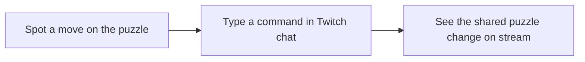

# Team Solve for SudokuPad

**A preview of a new way to solve a puzzle together on Twitch.** Team Solve is still being designed, so the examples below show how it is intended to work once the streamer enables it.

When the streamer has a SudokuPad puzzle on screen, chatters the streamer has allowed can make a move by typing a short command in Twitch chat. The move appears on the shared puzzle, where everyone can see it. You do not need to take control of the streamer's screen or wait for a vote on each move.



## Turning on and off team solve
The streamer decides when Team Solve is on and who may contribute. They might open it to everyone, followers, subscribers, or selected chatters. Watch chat for the announcement that Team Solve is on.

The streamer can turn Team Solve off at any time. When it is off, chat commands will not change the puzzle.

## Before you make a move

To name a cell, count **rows from top to bottom** and **columns from left to right**. For example, `r2c6` means row 2, column 6:

```text
       c1 c2 c3 | c4 c5 c6 | c7 c8 c9
      ----------+----------+---------
r1      .  .  . |  .  .  . |  .  .  .
r2      .  .  . |  .  .  X |  .  .  .
r3      .  .  . |  .  .  . |  .  .  .
      ----------+----------+---------
r4      .  .  . |  .  .  . |  .  .  .
r5      .  .  . |  .  .  . |  .  .  .
r6      .  .  . |  .  .  . |  .  .  .
      ----------+----------+---------
r7      .  .  . |  .  .  . |  .  .  .
r8      .  .  . |  .  .  . |  .  .  .
r9      .  .  . |  .  .  . |  .  .  .

X = the cell at r2c6 (not a number entered in the puzzle)
```

For the basic moves below, start with `$`, then type the cell, a space, and what you want to do.

## A few example moves

### Put a number in a cell

You spot that row 2, column 6 should be a 5. Type this in Twitch chat:

```text
$r2c6 5
```

The 5 appears in that cell on the stream. If you change your mind, erase an entered value with:

```text
$r2c6 -
```

### Add pencil marks

You are considering 1, 5, or 9 for row 3, column 4. Add small corner notes with:

```text
$r3c4 ^159
```

Want those numbers in the center of the cell instead? Use `*`:

```text
$r3c4 *159
```

### Color a cell

You want to change the color of the cell at row 4, column 7. Type:

```text
$r4c7 c2
```

That adds palette color 2 to the cell. The color's meaning is up to the people solving the puzzle together.

### Full command list

For the full list of commands, see the [Twitch command language](docs/twitch-command-language.md).

## What happens after you send a command?

* Watch the puzzle on stream: a visible change is the usual sign that your move worked.
* If your command is written incorrectly or you are not allowed to make moves right now, the streamer's bot will tell you.
* Some moves cannot change the puzzle, such as trying to replace a number that was given at the start. These moves will fail silently.
