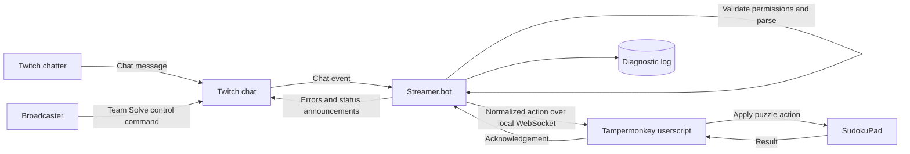
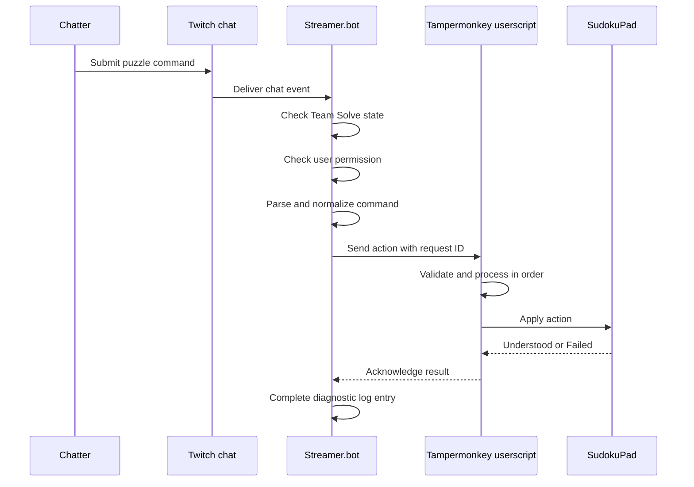

# Team Solve for SudokuPad

Status: Initial design draft  
Target: Chrome, Tampermonkey, Streamer.bot, and `sudokupad.app`

## Purpose

Team Solve lets authorized Twitch chatters collaboratively solve the Sudoku puzzle that is open in the broadcaster's browser. Chatters describe changes to the puzzle; they do not remotely control the browser, select cells, or invoke browser-level controls.

The system receives Twitch chat through Streamer.bot, checks whether a chatter may contribute, parses the message into a structured puzzle action, and sends that action to a Tampermonkey userscript. The userscript applies the action to SudokuPad and reports the result to Streamer.bot.

## Documents

- [Twitch chat command language](twitch-command-language.md)
- [Tampermonkey userscript design](tampermonkey-userscript.md)
- [Streamer.bot structure](streamerbot-structure.md)

## System overview

Streamer.bot and Chrome will always run on the same computer. The userscript is deliberately independent of Twitch: it receives structured puzzle actions and does not know where or how they were generated.

## Core workflow

Valid actions are processed immediately in chat-message order. There is no voting or broadcaster approval queue.

## Confirmed behavior

### Team Solve state

- Team Solve always starts **off** when Streamer.bot or the browser restarts.
- Only the broadcaster can turn Team Solve on or off through Twitch chat commands.
- The command that turns Team Solve on must also specify the active permission policy. A previous policy is not implicitly reused.
- Later commands can adjust permissions while keeping Team Solve on.
- Twitch chat is notified when Team Solve state is significantly changed.
- If the browser connection is lost, Streamer.bot turns Team Solve off and announces the disconnection in chat. Commands are not queued for later delivery.

### Permissions

The design must be able to allow contributions from:

- everyone;
- followers;
- subscribers; and
- specifically named users.

The exact policy syntax and whether these categories can be combined remain open design decisions.

### Puzzle actions

The full command model should accommodate:

- setting and erasing digits;
- adding, removing, or clearing pencil marks;
- adding, removing, or clearing colors;
- adding and removing lines;
- adding and removing border lines; and
- future SudokuPad mark types without redesigning the whole language.

Chatters identify cells by row and column. Both `r3c7` and `c7r3` refer to row 3, column 7.

An action's intent should be obvious from it's command, such as add, remove, set, erase, or clear. It should not depend on an ambiguous toggle whose result varies with the current board state.

Commands that cannot affect the puzzle are silently ignored by the user script. They are essentially treated as successful. Examples include changing a given digit, adding a pencil mark to a cell that already contains a digit, or targeting something outside the playable grid.

### User feedback

- Invalid syntax produces chat-visible feedback.
- Lack of permission produces chat-visible feedback.
- Successful actions are shown through visible change in SudokuPad as their user feedback; success messages do not get sent to chat.
- Actions that have no possible effect are exeucted with not visible indication.
- Browser execution failures are recorded for diagnosis. The exact chat response for an execution failure remains to be designed.

### Diagnostics

Streamer.bot keeps a persistent, per-stream diagnostic log. Each action should be traceable through these stages:

1. chat message received;
2. Team Solve and permission decision;
3. parse result;
4. WebSocket send result;
5. userscript acknowledgement; and
6. SudokuPad outcome: understood or error.

Log entries include timestamps, a correlation/request ID, and the Twitch user where applicable. Logs must avoid recording credentials or authentication secrets.

## Delivery phases

The action and protocol design should be extensible from the beginning, even though implementation is incremental.

| Phase | Goal | Minimum proof |
| --- | --- | --- |
| 0 | Connection and diagnostics | Userscript connects locally; Streamer.bot sends a test action and receives an acknowledgement |
| 1 | Digits | Authorized chatters can set and erase digits |
| 2 | Pencil marks | Authorized chatters can add, remove, and clear pencil marks |
| 3 | Colors | Authorized chatters can add, remove, and clear colors; ready for initial channel debut |
| 4 | Extended marks | Lines and border lines are supported |
| 5 | Operational controls | Optional rate limits, cooldowns, and additional moderation tools |

Each phase should preserve the command-language and transport model established for later phases.

## Design principles

- Keep Twitch-specific parsing and permissions in Streamer.bot.
- Keep SudokuPad-specific execution in the userscript.
- Use a versioned, normalized action contract between the two components.
- Preserve message order and make each action traceable end to end.
- Fail safely: Team Solve is off by default and turns off when its browser connection is lost.
- Validate at boundaries even though communication is local to one computer.
- Prefer explicit operations over state-dependent toggles.

## Open decisions

- Exact Twitch command names and grammar
- Whether permission categories are exclusive or cumulative
- Representation of specific-user allowlists
- Whether one command may target multiple cells, especially for lines
- Exact semantics for colors, lines, borders, and clearing a mark type
- SudokuPad integration method and stable page hooks
- WebSocket protocol fields, authentication needs, timeouts, and version negotiation
- Chat behavior for browser-side execution failures
- Rate-limit and cooldown policy after the initial release

