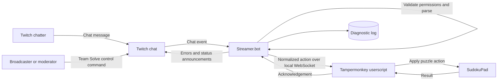
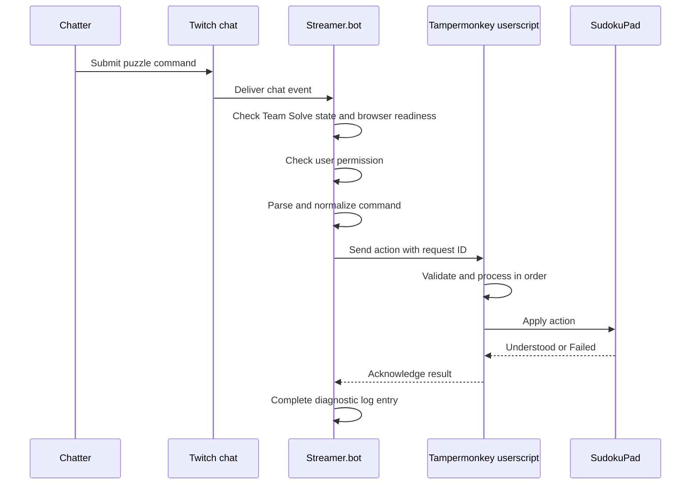

# Team Solve for SudokuPad

Status: Initial design draft  
Target: Chrome, Tampermonkey, Streamer.bot, and `sudokupad.app`

## Purpose

Team Solve lets authorized Twitch chatters collaboratively solve the Sudoku puzzle that is open in the broadcaster's browser. Chatters describe changes to the puzzle; they do not remotely control the browser, select cells, or invoke browser-level controls.

The system receives Twitch chat through Streamer.bot, checks whether a chatter may contribute, parses the message into a structured puzzle action, and sends that action to a Tampermonkey userscript. The userscript applies the action to SudokuPad and reports the result to Streamer.bot.

## Documents

- [Team Solve streamer commands](streamer-commands.md)
- [Twitch chat command language](twitch-command-language.md)
- [Tampermonkey userscript design](tampermonkey-userscript.md)
- [Streamer.bot structure](streamerbot-structure.md)

## System overview

```mermaid
flowchart LR
    Chatter[Twitch chatter] -->|Chat message| Twitch[Twitch chat]
    Twitch -->|Chat event| SB[Streamer.bot]
    Controller[Broadcaster or moderator] -->|Team Solve control command| Twitch
    SB -->|Validate permissions and parse| SB
    SB -->|Normalized action over local WebSocket| TM[Tampermonkey userscript]
    TM -->|Apply puzzle action| SP[SudokuPad]
    SP -->|Result| TM
    TM -->|Acknowledgement| SB
    SB -->|Errors and status announcements| Twitch
    SB --> Log[(Diagnostic log)]
```

Streamer.bot and Chrome will always run on the same computer. The userscript is deliberately independent of Twitch: it receives structured puzzle actions and does not know where or how they were generated.

## Core workflow

```mermaid
sequenceDiagram
    participant C as Chatter
    participant T as Twitch chat
    participant S as Streamer.bot
    participant U as Tampermonkey userscript
    participant P as SudokuPad

    C->>T: Submit puzzle command
    T->>S: Deliver chat event
    S->>S: Check Team Solve state and browser readiness
    S->>S: Check user permission
    S->>S: Parse and normalize command
    S->>U: Send action with request ID
    U->>U: Validate and process in order
    U->>P: Apply action
    P-->>U: Understood or Failed
    U-->>S: Acknowledge result
    S->>S: Complete diagnostic log entry
```

Valid actions are processed immediately in chat-message order. There is no voting or broadcaster approval queue.

## Confirmed behavior

### Team Solve state

- Team Solve requires independent enablement in Streamer.bot through Twitch commands and in the SudokuPad tab UI. Neither switch changes the other.
- Streamer.bot persists its on/off state, selected access option, and named-user list across sessions. Startup always restores the saved state; there is no startup configuration option.
- The browser switch starts disabled on every puzzle load or reload. Enabling it connects and requests activation for the current puzzle. Only one tab may have the accepted session; accepting another tab revokes the previous one.
- On first setup, Team Solve is **off**, with list access selected and an empty list.
- The broadcaster and moderators control Team Solve through one command, `!teamsolve`, with different parameters. See the [streamer command guide](streamer-commands.md) for the complete command set.
- Selecting `everyone`, `followers`, `subscribers`, or `list` saves that access option and turns Team Solve on. When already on, the change takes effect immediately.
- `!teamsolve off` turns it off without clearing the selected access option or list. `!teamsolve` without parameters reports status and saved access settings without changing anything.
- Team Solve accepts puzzle actions only while both switches are enabled and the selected browser session is accepted and ready. Enabling the Streamer.bot side before the browser is ready makes it wait and start automatically when these conditions are met.
- A transient connection loss pauses contributions without changing either switch. The still-selected tab may resume automatically once accepted and ready, unless either side has been disabled. Replacement or rejected resume requires explicit browser enablement again. Commands are not queued for later delivery.
- Disabling the browser discards queued actions, releases its session, and stops reconnecting. Disabling Streamer.bot stops new dispatch while the browser may remain enabled and connected.
- Command replies, access changes, and announcements about starting, stopping, waiting, and resuming appear publicly in Twitch chat.

### Permissions

Exactly one access option applies at a time:

- everyone;
- followers;
- subscribers; and
- specifically named users on the saved list.

The broadcaster and moderators can always contribute while Team Solve is on and the browser is ready, regardless of the selected option.

The selected option and named-user list persist independently. Switching to another option keeps the list. `!teamsolve list` reuses it; `!teamsolve list Alice Bob` replaces it with the supplied names. With list access selected, an empty list allows only the broadcaster and moderators to contribute. `!teamsolve` reports the saved list even when another option is selected.

### Puzzle actions

The full command model should accommodate:

- setting and erasing digits;
- adding, removing, or clearing pencil marks;
- adding, removing, or clearing colors;
- adding and removing lines;
- adding and removing border lines; and
- future SudokuPad mark types without redesigning the whole language.

Chatters identify cells by row and column. Both `r3c7` and `c7r3` refer to row 3, column 7.

An action's intent should be obvious from it's command, such as add, remove, set, erase, or clear. It should not depend on an ambiguous toggle whose result varies with the current board state.

Commands that cannot affect the puzzle are silently ignored by the user script. They are essentially treated as successful. Examples include changing a given digit, adding a pencil mark to a cell that already contains a digit, or targeting something outside the playable grid.

### User feedback

- Invalid syntax produces chat-visible feedback.
- Lack of permission produces chat-visible feedback.
- Successful puzzle actions are shown through visible change in SudokuPad as their user feedback; puzzle-action success messages do not get sent to chat. Control commands receive public replies.
- Actions that have no possible effect are exeucted with not visible indication.
- Browser execution failures are recorded for diagnosis. The exact chat response for an execution failure remains to be designed.

### Diagnostics

Streamer.bot keeps a persistent, per-stream diagnostic log. Each action should be traceable through these stages:

1. chat message received;
2. Team Solve and permission decision;
3. parse result;
4. WebSocket send result;
5. userscript acknowledgement; and
6. SudokuPad outcome: understood or error.

Log entries include timestamps, a correlation/request ID, and the Twitch user where applicable. Logs must avoid recording credentials or authentication secrets.

## Delivery phases

The action and protocol design should be extensible from the beginning, even though implementation is incremental.

| Phase | Goal | Minimum proof |
| --- | --- | --- |
| 0 | Connection and diagnostics | Userscript connects locally; Streamer.bot sends a test action and receives an acknowledgement |
| 1 | Digits | Authorized chatters can set and erase digits |
| 2 | Pencil marks | Authorized chatters can add, remove, and clear pencil marks |
| 3 | Colors | Authorized chatters can add, remove, and clear colors; ready for initial channel debut |
| 4 | Extended marks | Lines and border lines are supported |
| 5 | Operational controls | Optional rate limits, cooldowns, and additional moderation tools |

Each phase should preserve the command-language and transport model established for later phases.

## Design principles

- Keep Twitch-specific parsing and permissions in Streamer.bot.
- Keep SudokuPad-specific execution in the userscript.
- Use a versioned, normalized action contract between the two components.
- Preserve message order and make each action traceable end to end.
- Restore Streamer.bot's saved on/off state and access settings, and require browser enablement for each loaded puzzle instance. Pause contributions when the browser is unavailable and resume only when both switches are enabled and the selected session is accepted and ready.
- Validate at boundaries even though communication is local to one computer.
- Prefer explicit operations over state-dependent toggles.

## Open decisions

- Persistent storage and Twitch identity handling for the named-user list
- Whether one command may target multiple cells, especially for lines
- Exact semantics for colors, lines, borders, and clearing a mark type
- SudokuPad integration method and stable page hooks
- WebSocket protocol fields, authentication needs, timeouts, and version negotiation
- Chat behavior for browser-side execution failures
- Rate-limit and cooldown policy after the initial release
