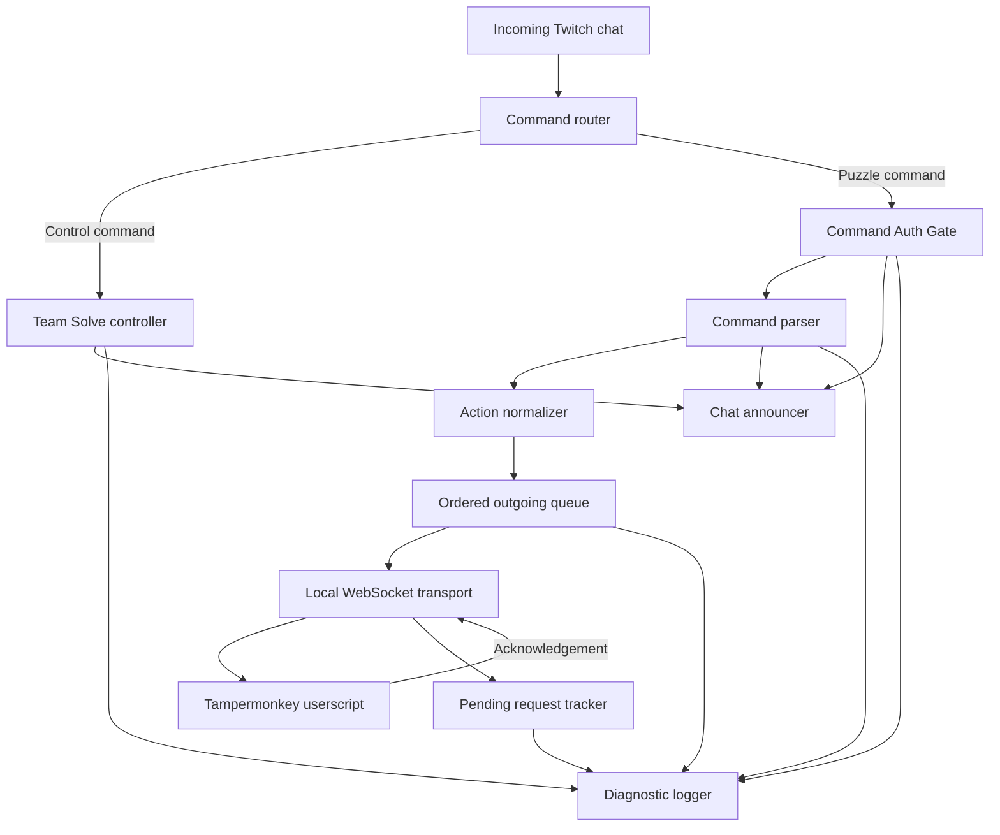
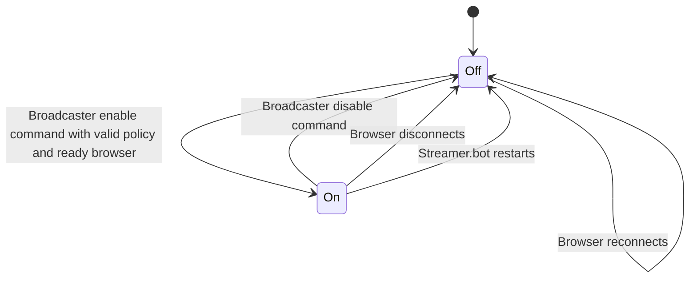
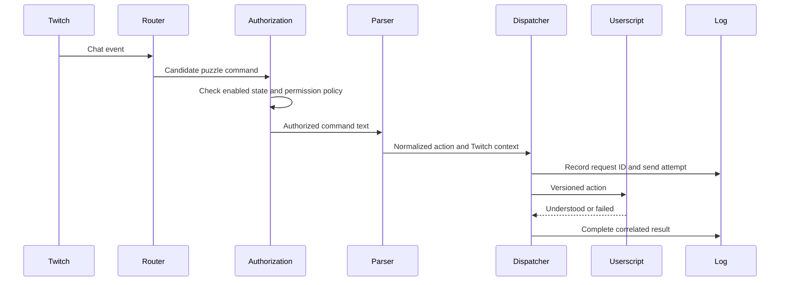

# Streamer.bot Structure

Status: Architecture and workflow draft

## Purpose

Streamer.bot owns the Twitch-facing workflow. It receives chat events, controls whether Team Solve is active, authorizes chatters, parses the command language, sends normalized actions to the browser, reports selected errors and status changes to chat, and keeps the diagnostic log.

## Responsibilities

- Receive Twitch chat messages in arrival order.
- Recognize broadcaster-only Team Solve control commands.
- Start Team Solve only when an explicit permission policy is supplied.
- Check the active permission policy for every puzzle command.
- Parse valid chat syntax into a source-independent action.
- Assign a request ID and preserve the Twitch context for diagnostics.
- Deliver actions to the Tampermonkey userscript over a local WebSocket.
- Match browser acknowledgements to pending requests.
- Notify chat about syntax errors, permission failures, and Team Solve state changes.
- Turn Team Solve off and notify chat if the browser disconnects.
- Persist per-stream diagnostic logs.

## Suggested logical structure

These are responsibility groups, not final Streamer.bot action names.

Suggested modules or grouped actions:

| Area | Purpose |
| --- | --- |
| Command router | Separates broadcaster controls from puzzle commands and unrelated chat |
| Team Solve controller | Owns enabled state and the current permission policy |
| Command Auth gate | Validates enabled state and permissions for everyone, follower, subscriber, and specific-user policies |
| Command parser | Implements the documented human-facing grammar |
| Action normalizer | Produces the versioned, source-independent action contract |
| Ordered dispatcher | Preserves chat arrival order and manages pending requests |
| WebSocket transport | Tracks the browser connection and sends/receives protocol messages |
| Chat announcer | Sends concise status and error feedback, does not write success messages |
| Diagnostic logger | Writes correlated, structured logs |

## Runtime state

| State | Initial value | Notes |
| --- | --- | --- |
| Team Solve enabled | `false` | Must always reset to off after restart |
| Active permission policy | none | Must be supplied by each successful enable command |
| Browser connection | disconnected until handshake | Loss of an active connection disables Team Solve |
| Outgoing action queue | empty | FIFO; commands are not retained across disconnects or restarts |
| Pending requests | empty | Keyed by request ID until acknowledgement or timeout |

The previous permission policy must not be silently reused. It may be recorded in logs, but a fresh policy is required to enable Team Solve again.

## Enable and disable workflow

When Team Solve enters `On` or `Off`, Streamer.bot announces the change in Twitch chat. A browser reconnection makes the transport ready but does not turn Team Solve back on.

An enable request while the browser is disconnected results in Team Solve remaining off with a broadcaster-visible error.

## Puzzle-command workflow

Valid actions are dispatched immediately in Twitch event order. There is no vote or approval stage. The dispatcher must not apply commands received during a disconnect after a later reconnection.

## Feedback policy

| Condition | Twitch chat | Diagnostic log |
| --- | --- | --- |
| Team Solve enabled or disabled | Announce | Record |
| Browser disconnects while enabled | Announce that Team Solve was turned off | Record |
| User lacks permission | Send concise error | Record decision |
| Command syntax is invalid | Send concise usage feedback | Record parse result |
| Action applied | No reply; the board is the feedback | Record acknowledgement |
| Browser execution fails | To be decided | Record failure and reason |

Repeated public errors may eventually need cooldowns to prevent chat spam.

## Permission model

The controller must support policies involving everyone, followers, subscribers, and specific users. The policy is provided in the broadcaster's enable command.

The design still needs to determine:

- whether these options are mutually exclusive or composable;
- whether a named-user list supplements a general audience category;
- the precedence of broadcaster and moderator privileges;
- how follower/subscriber status is obtained and how stale data is handled; and
- username normalization and rename behavior.

Until those decisions are made, the permission evaluator should remain a separate component rather than embedding checks throughout the parser.

## WebSocket transport

The planned transport is Streamer.bot's WebSocket capability over the local machine. Alternatives can be evaluated during the connection prototype, but the component boundary stays the same: Streamer.bot sends a versioned normalized action, and the browser returns a correlated acknowledgement.

Required transport behavior:

- know whether an eligible userscript is connected and ready;
- preserve FIFO delivery;
- assign or propagate unique request IDs;
- use bounded timeouts and pending-request storage;
- fail pending and new requests on disconnect;
- trigger the Team Solve shutdown workflow after a connection loss; and
- reject malformed, duplicate, or incompatible acknowledgements safely.

## Diagnostic logging

Use one persistent log per streaming session. A structured format such as JSON Lines is preferred because it remains readable while being easy to filter.

Each command record should contain, where applicable:

- timestamp;
- request ID;
- Twitch username and stable user ID;
- original command text or a safely redacted representation;
- Team Solve state and permission result;
- parse result and normalized action;
- send time and WebSocket result;
- acknowledgement time, outcome, and reason code; and
- elapsed time through each stage.

Control commands and connection state changes should also be logged. Authentication values and credentials must never appear in the log.

## Future rate limiting

Per-user rate limits and cooldowns are explicitly planned but are not required for the first version. The future limiter belongs between authorization and parsing/dispatch. Its design should consider broadcaster and moderator exemptions, burst behavior, feedback spam, and whether different action types have different costs.

## Open decisions

- Concrete Streamer.bot action/group organization and naming
- Broadcaster control-command syntax
- Permission-policy composition and specific-user workflow
- WebSocket setup details, ports, handshake, and protocol schema
- Behavior when enabling while the browser is disconnected or not on a supported puzzle
- Timeout and failure feedback behavior
- Log storage path and session-boundary detection
- Twitch API/cache behavior for follower and subscriber checks
- Rate-limit and cooldown rules

