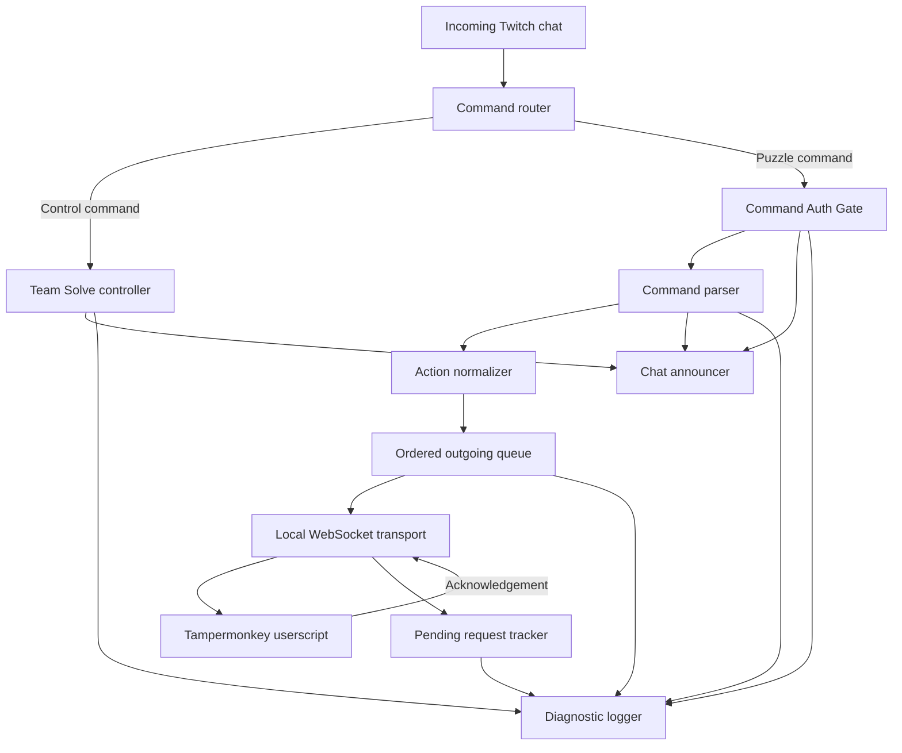
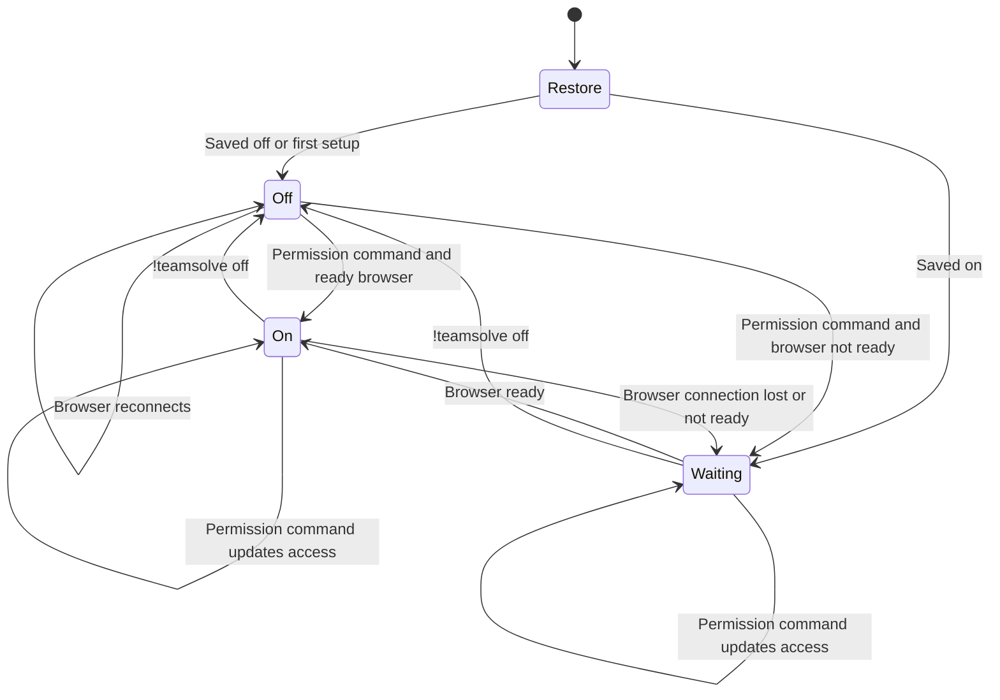
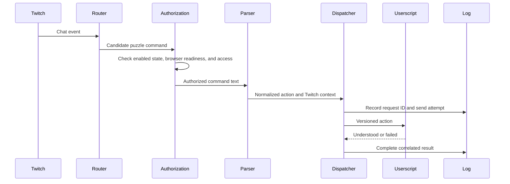

# Streamer.bot Structure

Status: Architecture and workflow draft

## Purpose

Streamer.bot owns the Twitch-facing workflow. It receives chat events, controls whether Team Solve is active, authorizes chatters, parses the command language, sends normalized actions to the browser, reports selected errors and status changes to chat, and keeps the diagnostic log.

Streamer.bot's saved switch and the SudokuPad tab's browser switch are independent. Commands require both to be enabled and the selected browser session to be accepted and ready. A tab connects only after explicit browser enablement, or to resume an eligible selection after a transient disconnect. Turning Streamer.bot off stops new dispatch without disabling the browser; disabling the browser releases its session without changing Streamer.bot's saved settings. Component and session ownership are detailed in the [component design](../src/design.md).

## Responsibilities

- Receive Twitch chat messages in arrival order.
- Recognize the single `!teamsolve` control command and restrict it to the broadcaster and moderators.
- Save the selected access option and enable Team Solve when a permission is set.
- Persist and restore the on/off state, selected access option, and named-user list across sessions.
- Check enabled state, browser readiness, and the selected access option for every puzzle command.
- Parse valid chat syntax into a source-independent action.
- Assign a request ID and preserve the Twitch context for diagnostics.
- Deliver actions to the Tampermonkey userscript over a local WebSocket.
- Match browser acknowledgements to pending requests.
- Send public control-command replies and notify chat about syntax errors, permission failures, access changes, and Team Solve state changes.
- Pause contributions and notify chat if the browser disconnects; resume automatically when ready if Team Solve is still enabled.
- Persist per-stream diagnostic logs.

## Suggested logical structure

These are responsibility groups, not final Streamer.bot action names.

Register one streamer control command, `!teamsolve`, and route its parameters through a shared controller. The permission choices, status query, and `off` parameter do not need separate Streamer.bot command entries. The human-facing behavior is defined in the [streamer command guide](streamer-commands.md).

```mermaid
flowchart TD
    Chat[Incoming Twitch chat] --> Router[Command router]
    Router -->|Control command| Control[Team Solve controller]
    Router -->|Puzzle command| Gate[Command Auth Gate]
    Gate --> Parser[Command parser]
    Parser --> Normalizer[Action normalizer]
    Normalizer --> Queue[Ordered outgoing queue]
    Queue --> WS[Local WebSocket transport]
    WS --> Browser[Tampermonkey userscript]
    Browser -->|Acknowledgement| WS
    WS --> Tracker[Pending request tracker]
    Control --> Announcer[Chat announcer]
    Gate --> Announcer
    Parser --> Announcer
    Control --> Log[Diagnostic logger]
    Gate --> Log
    Parser --> Log
    Queue --> Log
    Tracker --> Log
```

Suggested modules or grouped actions:

| Area | Purpose |
| --- | --- |
| Command router | Separates broadcaster/moderator controls from puzzle commands and unrelated chat |
| Team Solve controller | Owns and persists enabled state, the selected access option, and the named-user list |
| Command Auth gate | Requires enabled state and browser readiness, then checks the selected access option with broadcaster/moderator access always allowed |
| Command parser | Implements the documented human-facing grammar |
| Action normalizer | Produces the versioned, source-independent action contract |
| Ordered dispatcher | Preserves chat arrival order and manages pending requests |
| WebSocket transport | Tracks the browser connection and sends/receives protocol messages |
| Chat announcer | Sends public control replies, status announcements, and errors; omits puzzle-action success messages |
| Diagnostic logger | Writes correlated, structured logs |

## Saved and runtime state

| State | First setup / initialization | Notes |
| --- | --- | --- |
| Team Solve enabled | `false` on first setup | Persist and restore after restart; connection loss does not change it |
| Selected access option | `list` on first setup | Persist and restore exactly one of `everyone`, `followers`, `subscribers`, or `list` |
| Named-user list | empty on first setup | Persist independently of the selected access option; supplied names replace the entire list |
| Browser connection | unavailable until an explicitly enabled tab is accepted and ready | Only one selected session; connection loss pauses contributions while preserving Streamer.bot's enabled state |
| Outgoing action queue | empty | FIFO; commands are not retained across disconnects or restarts |
| Pending requests | empty | Keyed by request ID until acknowledgement or timeout |

Startup always restores the saved enabled state, selected access option, and list. There is no configurable startup policy. If no saved settings exist, use the first-setup values above. Restoring enabled state does not permit dispatch until the browser is ready.

Public status distinguishes `Off` (disabled), `Waiting` (enabled but the browser is not ready), and `On` (enabled and ready). `Waiting` preserves an enabled state, including across restarts. Turning Team Solve off while waiting saves disabled state and prevents automatic starting or resuming.

## Enable and disable workflow

```mermaid
stateDiagram-v2
    [*] --> Restore
    Restore --> Off: Saved off or first setup
    Restore --> Waiting: Saved on
    Off --> Off: Puzzle commands do not execute
    Off --> On: Permission command and ready browser
    Off --> Waiting: Permission command and browser not ready
    On --> On: Permission command updates access
    On --> Waiting: Browser connection lost or not ready
    Waiting --> On: Browser ready
    Waiting --> Waiting: Permission command updates access
    On --> Off: !teamsolve off
    Waiting --> Off: !teamsolve off
    Off --> Off: Browser reconnects
```

Only the broadcaster and moderators can issue control commands. `!teamsolve everyone`, `!teamsolve followers`, `!teamsolve subscribers`, and `!teamsolve list [names]` save the selected access option and enable Team Solve. While already on, a new selection takes effect immediately. Supplying names with `list` replaces the saved list; omitting names keeps it. Selecting another option also keeps the list.

`!teamsolve off` disables Team Solve without clearing access settings. `!teamsolve` without parameters reports the public status, selected access option, and saved list without changing state, even when list access is not selected.

When Team Solve starts, stops, waits for a connection, or resumes, Streamer.bot announces the change in Twitch chat. An enable request while disconnected enters `Waiting` and automatically starts when the browser is ready. Connection loss while enabled also enters `Waiting`; reconnecting resumes contributions unless Team Solve has been explicitly turned off.

## Puzzle-command workflow

```mermaid
sequenceDiagram
    participant T as Twitch
    participant R as Router
    participant A as Authorization
    participant P as Parser
    participant D as Dispatcher
    participant U as Userscript
    participant L as Log

    T->>R: Chat event
    R->>A: Candidate puzzle command
    A->>A: Check enabled state, browser readiness, and access
    A->>P: Authorized command text
    P->>D: Normalized action and Twitch context
    D->>L: Record request ID and send attempt
    D->>U: Versioned action
    U-->>D: Understood or failed
    D->>L: Complete correlated result
```

Valid actions are dispatched immediately in Twitch event order. There is no vote or approval stage. The dispatcher must not apply commands received during a disconnect after a later reconnection.

## Feedback policy

| Condition | Twitch chat | Diagnostic log |
| --- | --- | --- |
| Team Solve enabled or disabled | Announce | Record |
| Enabled while the browser is not ready | Announce that Team Solve is waiting for a connection | Record |
| Browser disconnects or becomes unavailable while enabled | Announce that contributions are paused and will resume when ready | Record |
| Browser becomes ready while enabled | Announce that Team Solve started or resumed | Record |
| Selected access option or named-user list changes | Announce the resulting access settings | Record |
| Control command received | Reply publicly; a change announcement can serve as the reply | Record command and result |
| Bare `!teamsolve` status query | Show off/on/waiting status, selected access option, and saved list | Record |
| User lacks permission | Send concise error | Record decision |
| Command syntax is invalid | Send concise usage feedback | Record parse result |
| Action applied | No reply; the board is the feedback | Record acknowledgement |
| Browser execution fails | To be decided | Record failure and reason |

Repeated public errors may eventually need cooldowns to prevent chat spam.

## Permission model

The controller uses exactly one selected access option: everyone, followers, subscribers, or the saved named-user list. The broadcaster and moderators always pass the permission check, but their puzzle commands still require Team Solve to be enabled and the browser to be ready. They can use control commands while Team Solve is off or waiting.

The selected option and list are saved across sessions. List membership grants access only when `list` is selected; it does not supplement another option. With list access selected, an empty list permits only the broadcaster and moderators. Switching options preserves the list, and `!teamsolve list` without names selects that saved list and enables Team Solve. Supplying names replaces the list rather than adding to it.

Implementation decisions still needed:

- persistent storage and representation of the named-user list;
- how follower/subscriber status is obtained and how stale data is handled; and
- username normalization and rename behavior.

Keep the permission evaluator separate from puzzle-command parsing.

## WebSocket transport

The planned transport is Streamer.bot's WebSocket capability over the local machine. Alternatives can be evaluated during the connection prototype, but the component boundary stays the same: Streamer.bot sends a versioned normalized action, and the browser returns a correlated acknowledgement.

Required transport behavior:

- track the single explicitly enabled, accepted browser session and its readiness;
- preserve FIFO delivery;
- assign or propagate unique request IDs;
- use bounded timeouts and pending-request storage;
- fail pending and new requests on disconnect;
- move enabled Team Solve into a waiting state after a connection loss and resume dispatch when ready unless it has been disabled; and
- reject malformed, duplicate, or incompatible acknowledgements safely.

## Diagnostic logging

Use one persistent log per streaming session. A structured format such as JSON Lines is preferred because it remains readable while being easy to filter.

Each command record should contain, where applicable:

- timestamp;
- request ID;
- Twitch username and stable user ID;
- original command text or a safely redacted representation;
- Team Solve state and permission result;
- parse result and normalized action;
- send time and WebSocket result;
- acknowledgement time, outcome, and reason code; and
- elapsed time through each stage.

Control commands and connection state changes should also be logged. Authentication values and credentials must never appear in the log.

## Future rate limiting

Per-user rate limits and cooldowns are explicitly planned but are not required for the first version. The future limiter belongs between authorization and parsing/dispatch. Its design should consider broadcaster and moderator exemptions, burst behavior, feedback spam, and whether different action types have different costs.

## Open decisions

- Internal Streamer.bot action/group organization behind the single `!teamsolve` command
- Persistent settings storage and named-user identity handling
- WebSocket setup details, ports, handshake, and protocol schema
- Detection of browser readiness while a puzzle is loading, changing, or unsupported
- Timeout and failure feedback behavior
- Log storage path and session-boundary detection
- Twitch API/cache behavior for follower and subscriber checks
- Rate-limit and cooldown rules
