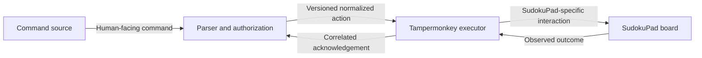
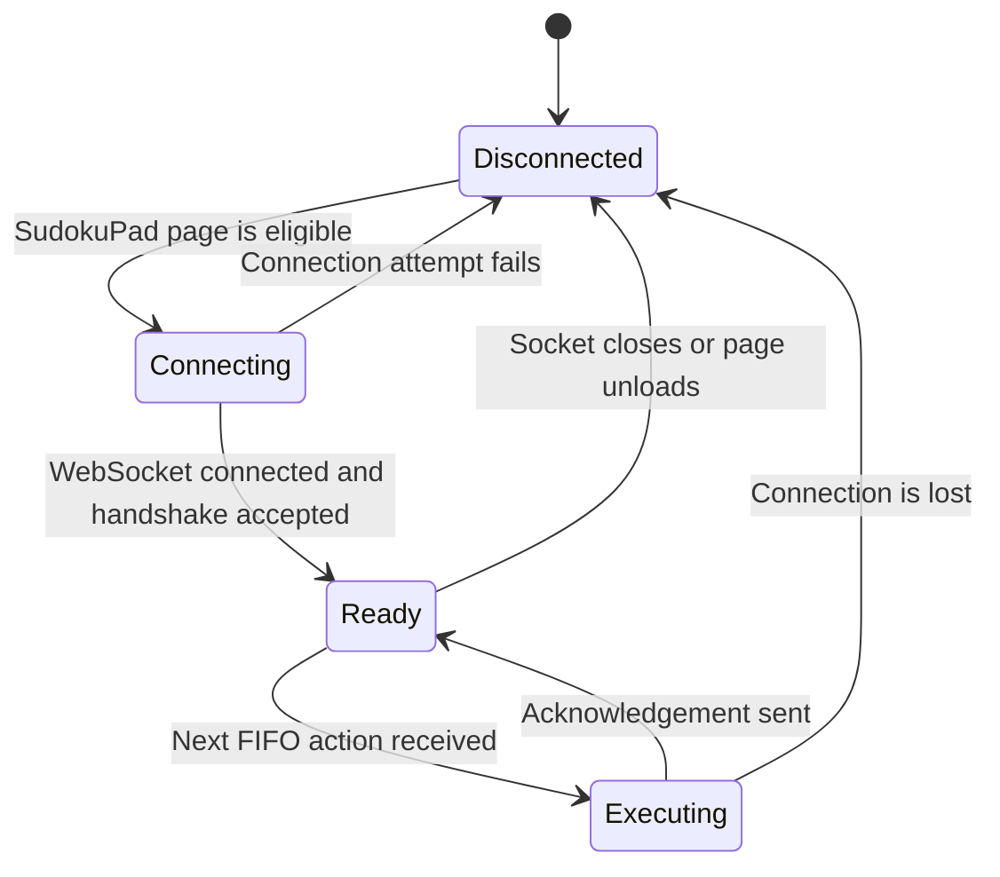

# Tampermonkey Userscript Design

Status: Architecture draft

## Purpose

The Tampermonkey userscript is a source-agnostic SudokuPad action executor. It receives normalized actions over a local WebSocket connection, applies them to `sudokupad.app`, and returns structured acknowledgements.

The initial supported environment is Tampermonkey in Google Chrome. Streamer.bot and Chrome run on the same computer.

## Responsibilities

- Connect to the local action service exposed by Streamer.bot.
- Report connection and readiness state.
- Validate incoming protocol messages and supported protocol versions.
- Preserve FIFO action order.
- Translate normalized actions into SudokuPad interactions.
- Determine whether an action was applied, ignored, or failed.
- Return a correlated acknowledgement for every accepted request.
- Provide useful diagnostic details without exposing secrets.

## Out of scope

The userscript does not:

- connect to Twitch;
- parse chat commands;
- know whether the sender is a follower, subscriber, moderator, or broadcaster;
- decide who has permission;
- send Twitch chat messages; or
- implement voting or approval workflows.

This boundary allows other trusted command sources to use the same executor later without changing its SudokuPad integration.

## Component boundary

## Connection lifecycle

The userscript may reconnect so that the broadcaster can restore service, but Streamer.bot must turn Team Solve off as soon as the active connection is lost. Pending commands are failed, not saved for later execution. Reconnection alone must not re-enable Team Solve.

## Normalized action model

The final wire format is not yet fixed. 

## Acknowledgements

Every accepted request returns the same request ID and one of three outcomes:

- `understood`: The command was understood and executed.
- `failed`: The request could not be validated or executed as intended.

An acknowledgement may include a stable reason code and a short diagnostic description. Reason codes are preferable to parsing human-readable text in Streamer.bot.

 Unsupported protocol versions, malformed action messages, missing SudokuPad hooks, and unexpected execution errors are `failed` outcomes.

## Ordered execution

The executor uses a single FIFO action queue. It completes or times out one action before applying the next so that the visible board state matches Streamer.bot's message order. Each request must receive at most one terminal acknowledgement.

If an action times out or fails, it cannot be retried. It is simply failed and it is up to the user to send the request again in chat.

## SudokuPad integration

The implementation method needs a focused technical investigation. Candidate approaches include supported page APIs, stable internal application hooks, or carefully generated UI events. The selected approach should:

- behave like a legitimate SudokuPad edit;
- preserve SudokuPad's own state and rendering;
- work without cell selection being controlled by Twitch chat;
- avoid coupling to fragile presentation-only selectors when possible.

Lines and border lines should fit the normalized action model even if their SudokuPad adapters are implemented later.

## Validation and safety

- Accept connections and messages only through the intended local integration.
- Validate message type, protocol version, operation, mark type, target, and value.
- Reject unknown operations instead of evaluating arbitrary code or property paths.
- Bound queue length and message size.
- Do not accept executable JavaScript in protocol values.
- Avoid storing Twitch credentials or WebSocket secrets in logs.

## Implementation milestones

1. Establish the local WebSocket handshake and acknowledgement loop.
2. Detect whether the current page is a supported SudokuPad puzzle.
3. Apply and erase digits.
4. Add, remove, and clear pencil marks.
5. Add, remove, and clear colors.
6. Add line and border adapters.

## Open decisions

- Exact WebSocket handshake and message schemas
- Connection authentication or shared-token requirements for a localhost-only service
- SudokuPad APIs or internal hooks to use
- How to verify that a visible edit actually succeeded
- Readiness behavior while a puzzle is loading or changing
- Queue bounds, action timeout, and retry behavior
- Multi-cell target and path representation
- Detailed semantics for colors, lines, and borders
- Stable failure and ignored reason codes

