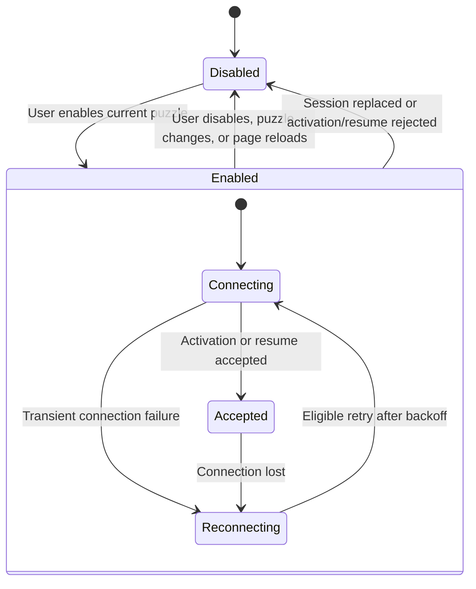

# Tampermonkey Userscript Design

Status: Architecture draft

## Purpose

The Tampermonkey userscript is a source-agnostic SudokuPad action executor. It receives normalized actions over a local WebSocket connection, applies them to `sudokupad.app`, and returns structured acknowledgements.

The initial supported environment is Tampermonkey in Google Chrome. Streamer.bot and Chrome run on the same computer.

The [component design](../src/design.md#tampermonkey) defines component ownership, internal relationships, and command handler functions. The [puzzle command protocol](../src/puzzle-command-protocol.md) defines action and acknowledgement messages. This guide describes browser behavior and integration constraints.

## Responsibilities

- Provide an explicit Team Solve enable/disable control for the current puzzle.
- Connect to the local action service exposed by Streamer.bot only when enabled for that puzzle.
- Report connection and readiness state.
- Validate incoming protocol messages and supported protocol versions.
- Preserve FIFO action order.
- Translate normalized actions into SudokuPad interactions.
- Keep each distinct command type in a separate ordered-executor handler function.
- Report processed actions, including valid actions with no effect, as `understood`; report validation or execution failures as `failed`.
- Produce at most one terminal acknowledgement per request and deliver it when the originating connection permits.
- Provide useful diagnostic details without exposing secrets.

## Out of scope

The userscript does not:

- connect to Twitch;
- parse chat commands;
- know whether the sender is a follower, subscriber, moderator, or broadcaster;
- decide who has permission;
- send Twitch chat messages; or
- implement voting or approval workflows.

This boundary allows other trusted command sources to use the same executor later without changing its SudokuPad integration.

## Components

| Component | Responsibility |
| --- | --- |
| Team Solve UI | Sends enable/disable intentions and displays tab enablement, connection, readiness, and replacement status. |
| Browser Team Solve controller | Owns enablement for the current puzzle instance and coordinates activation or shutdown. |
| Connection manager | Owns transport, accepted session state, eligible reconnection, and heartbeat responses. |
| Incoming message router | Validates envelopes and routes connection messages and puzzle actions to their owners. |
| SudokuPad Controller | Coordinates action validation, ordered execution, puzzle readiness, the adapter, and acknowledgement reporting. |
| Diagnostic logger | Records browser-side transitions and failures, including events that cannot be delivered to Streamer.bot. |

The connection manager contains the WebSocket transport, session tracker, reconnect scheduler, and heartbeat responder. The SudokuPad Controller contains the action validator, ordered action executor, puzzle readiness monitor, SudokuPad adapter, and acknowledgement reporter. Their detailed responsibilities and diagrams are in the [component design](../src/design.md#tampermonkey).

## Enablement and tab selection

Team Solve requires two independent switches: contributions enabled in Streamer.bot through the Twitch command interface, and Team Solve enabled in the SudokuPad tab UI. Changing one switch does not change the other. The browser control does not change Twitch access settings.

The browser switch starts disabled on every puzzle load or reload. Enabling it requests activation for that puzzle instance. Only one tab may hold the accepted session; accepting another tab revokes the previous session. The old tab disables itself when notified and requires a new explicit enable action. If it misses the close notification, Streamer.bot still rejects its attempts to resume the revoked selection.

Disabling the browser immediately prevents new edits from starting, discards queued actions, releases the session, cancels reconnect attempts, and closes the socket. Streamer.bot's saved switch remains unchanged. Conversely, `!teamsolve off` stops Streamer.bot from dispatching new actions while the enabled tab may remain connected.

The UI displays browser state such as disabled, connecting, ready to receive commands, reconnecting, or puzzle not ready, with an explanation after replacement or rejected resume. Browser readiness does not establish that Streamer.bot contributions are enabled. Showing that separate state would require an explicit message from Streamer.bot.

## Connection lifecycle

```mermaid
stateDiagram-v2
    [*] --> Disabled
    state Enabled {
        [*] --> Connecting
        Connecting --> Accepted: Activation or resume accepted
        Connecting --> Reconnecting: Transient connection failure
        Accepted --> Reconnecting: Connection lost
        Reconnecting --> Connecting: Eligible retry after backoff
    }
    Disabled --> Enabled: User enables current puzzle
    Enabled --> Disabled: User disables, puzzle changes, or page reloads
    Enabled --> Disabled: Session replaced or activation/resume rejected
```

Accepted session state and puzzle readiness are separate. Opening a socket alone does not permit execution. A session is available only after acceptance and fresh readiness reporting; readiness may subsequently become false while the connection stays open. Heartbeat and session-control messages are handled independently of the action queue.

Transient connection loss leaves the tab enabled but invalidates its connection session and discards queued actions. The reconnect scheduler uses bounded backoff while the same puzzle selection remains eligible. An initial activation retry remains tied to the user's enable request; after acceptance, reconnection requests a resume of that selection. A resume cannot replace another selected tab and must never fall back to automatic fresh activation when rejected. Every accepted new connection receives a fresh session identity and requires fresh readiness.

Streamer.bot pauses contributions on connection loss and closes pending requests without replaying them. Contributions resume only when the browser is available and both switches remain enabled. A lost acknowledgement does not prove that an action was not executed.

After a Streamer.bot restart, its saved switch and access settings are restored, but the browser must still establish an accepted session. Whether selection/resume eligibility survives a Streamer.bot restart remains a connection-protocol decision. Rejected resume always requires explicit browser enablement again.

## Normalized action model

The version 1 [puzzle command protocol](../src/puzzle-command-protocol.md) defines one action per request, with `requestId`, `sessionId`, and `puzzleId`. The browser validates the entire request before changing the puzzle and checks its session and puzzle identities on receipt and immediately before execution.

The readiness monitor generates a fresh puzzle-instance identifier whenever a puzzle loads, including a reload of the same puzzle. A new puzzle invalidates old queued work and clears browser enablement. A puzzle mismatch returns `failed` with `puzzleChanged` when a correlated reply can still be delivered; the reply echoes the original request identifiers.

Session activation/resume, release/close, heartbeat, readiness, and any Streamer.bot contribution-state message formats remain to be specified separately.

## Acknowledgements

Each terminal acknowledgement echoes the original request, session, and puzzle identifiers and uses one of two outcomes:

- `understood`: The action was processed, including valid actions that have no effect on the puzzle.
- `failed`: The request could not be validated or executed as intended.

A failed acknowledgement includes a stable reason code and may include a short diagnostic description. Code branches use the reason rather than parsing the description. The currently agreed codes are `puzzleNotReady` and `puzzleChanged`; other failure codes remain to be named in the protocol.

Unsupported protocol versions, malformed action messages, missing SudokuPad hooks, and unexpected execution errors produce failures when a correlated reply is possible. Malformed JSON or missing correlation identifiers is rejected and logged without inventing identifiers. Failed acknowledgement sends are logged locally and are not replayed on a new connection.

## Ordered execution

The executor owns a single FIFO action queue. Immediately before execution, it checks browser enablement, accepted session identity, puzzle identity, and readiness. It runs one action at a time and passes the result to the acknowledgement reporter before advancing. Session or puzzle invalidation discards queued work; actions are never retained for execution after reconnect or against a replacement puzzle.

`DispatchAction` selects a separate function for each command type:

| Action kind | Handler | Operations |
| --- | --- | --- |
| `value` | `HandleValue` | `set`, `clear` |
| `cornerMarks` | `HandleCornerMarks` | `add`, `remove`, `clear` |
| `centerMarks` | `HandleCenterMarks` | `add`, `remove`, `clear` |
| `color` | `HandleColor` | `add`, `remove`, `clear` |
| `x` | `HandleX` | `add`, `remove` |
| `o` | `HandleO` | `add`, `remove` |
| `line` | `HandleLine` | `add`, `remove` |

Each handler receives the validated action and original execution context, invokes the adapter, and returns a consistent result: `understood`, or `failed` with a reason and optional description. Queue management, execution guards, exception handling, and acknowledgement production remain in the shared execution path. Handlers do not send replies or change connection state.

Adding a new command type requires protocol and validation rules, a new dispatch entry and handler function, and adapter support. It does not require changes to queue or connection logic.

Neither side automatically retries failed or uncertain actions. Streamer.bot's acknowledgement deadline is a local timeout and does not cancel browser execution. The executor must not advance while a preceding adapter operation may still mutate the puzzle. If an operation yields asynchronously, it must recheck its original context before further edits. Already applied edits are not undone by disabling or replacing the session. Browser execution deadlines and cancellation support remain implementation decisions.

## SudokuPad integration

The implementation method needs a focused technical investigation. Candidate approaches include supported page APIs, stable internal application hooks, or carefully generated UI events. The selected approach should:

- behave like a legitimate SudokuPad edit;
- preserve SudokuPad's own state and rendering;
- work without cell selection being controlled by Twitch chat;
- avoid coupling to fragile presentation-only selectors when possible.

The adapter is the only component that knows SudokuPad's page APIs or internal hooks. It supplies inspection hooks to the readiness monitor and edit operations to command handlers. It checks puzzle-dependent constraints before mutation: for example, a valid request to change a given or target a positive coordinate outside the playable grid is `understood` without a visible change. Structural errors such as negative coordinates are rejected by the action validator.

The current protocol already represents values, corner and center marks, cell colors, X/O marks, and lines with positioned endpoints. Adapter implementations may arrive in stages, but unsupported actions must fail explicitly. This design does not prescribe a new wire format for future mark types.

## Validation and safety

- Accept connections and messages only through the intended local integration.
- Validate message type, protocol version, session/puzzle identity, operation, action kind, target, and value.
- Reject unknown operations instead of evaluating arbitrary code or property paths.
- Bound queue length and message size.
- Do not accept executable JavaScript in protocol values.
- Avoid storing Twitch credentials or WebSocket secrets in logs.

## Implementation milestones

1. Detect supported puzzle instances and provide the tab enable/disable UI.
2. Establish explicit activation, eligible resume, single-tab replacement, heartbeat/readiness reporting, and the acknowledgement loop.
3. Build the shared validation and ordered execution path, then implement `HandleValue` and its adapter operations.
4. Implement `HandleCornerMarks` and `HandleCenterMarks` with their adapter operations.
5. Implement `HandleColor` with its adapter operations.
6. Implement `HandleX`, `HandleO`, and `HandleLine` with their adapter operations.

## Open decisions

- Exact session activation/resume, release/close, heartbeat, and readiness message schemas
- Resume eligibility after a Streamer.bot restart and reconciliation of activation attempts interrupted before acceptance
- Connection authentication or shared-token requirements for a localhost-only service
- SudokuPad APIs or internal hooks to use
- Reliable puzzle load/reload detection and edit-completion verification
- Queue and message-size bounds, reconnect timing, and browser execution deadlines/cancellation
- Additional stable failure reason codes, including queue capacity and session mismatch
- Browser diagnostic storage and retention
- Whether the UI also displays Streamer.bot contribution state and, if so, its explicit state message
