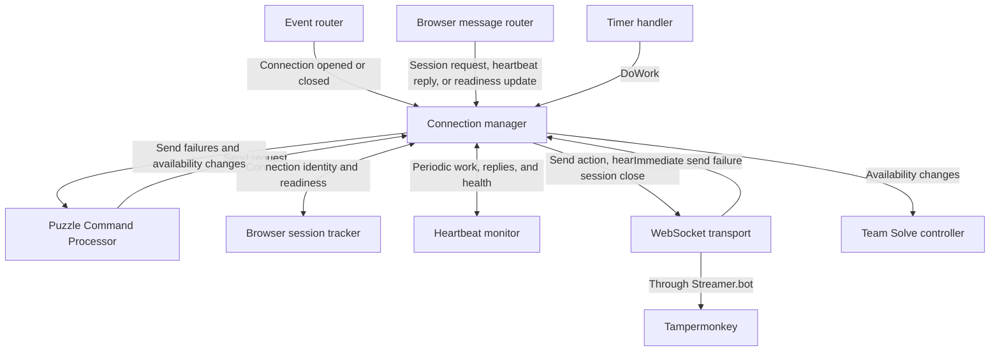
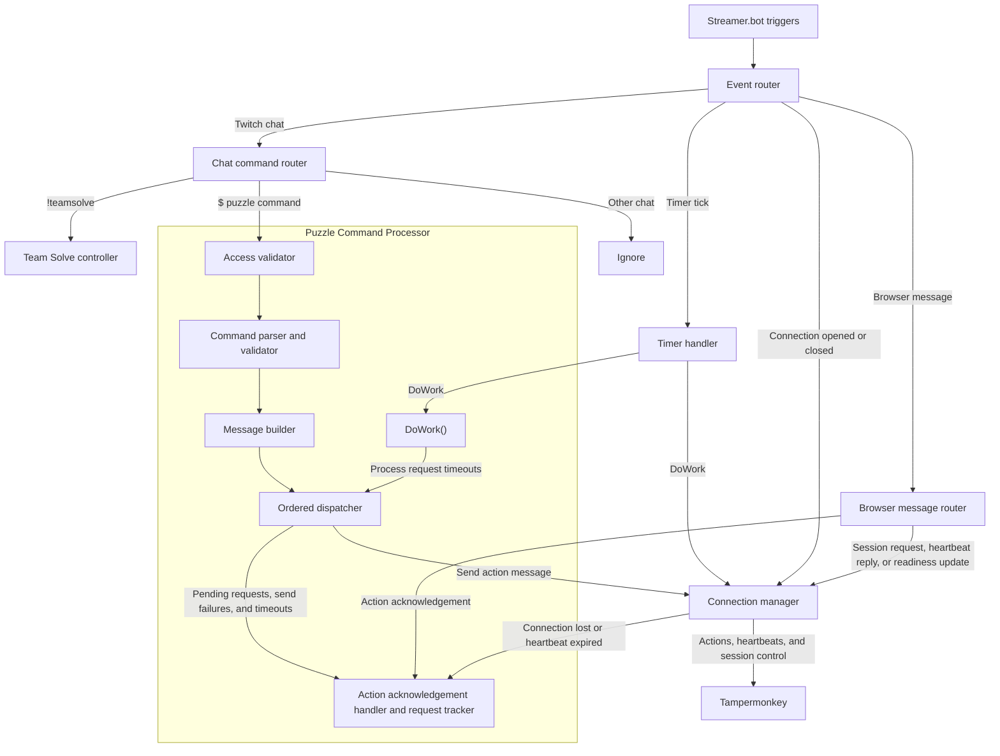
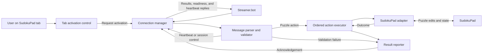

# Team Solve component design

First draft. These are logical components; each does not necessarily need its own file or Streamer.bot action. Streamer.bot owns chat input and contribution policy. Tampermonkey owns execution against the current SudokuPad puzzle. They communicate over a local WebSocket using structured action messages and correlated acknowledgements, defined in the [puzzle command protocol](puzzle-command-protocol.md).

## Streamer.bot

Routing has two levels. Streamer.bot triggers feed a top-level **event router**, which selects handlers by event type. Twitch chat and browser messages then pass through their own subrouters to select a handler by command or message type. Each timer tick goes to a timer handler, which calls `DoWork()` on the Puzzle Command Processor and the connection manager. Connection-opened/closed events go directly to the connection manager. These routers can be methods within the same C# script; they choose destinations while the receiving components own behavior and state.

| Component | Responsibility and relationships |
| --- | --- |
| Event router | Receives Twitch chat, timer ticks, connection-opened/closed events, and incoming browser messages from Streamer.bot triggers. Routes chat to the chat command router, browser messages to the browser message router, and connection events to the connection manager. Routes timer ticks to the timer handler. Preserves event context for the receiving component. |
| Timer handler | Receives timer ticks from the event router and calls `DoWork()` on the Puzzle Command Processor and the connection manager. Coordinates periodic work; each component owns its maintenance logic. |
| Chat command router | Separates puzzle commands, `!teamsolve` control commands, and unrelated chat. Routes puzzle commands to the Puzzle Command Processor and control commands to the Team Solve controller. Ignores unrelated chat and preserves command text, sender context, and puzzle-command arrival order. |
| Browser message router | Decodes and validates incoming message envelopes, then routes session activation/resume requests, heartbeat replies, and readiness updates to the connection manager and action acknowledgements to the Puzzle Command Processor. Preserves connection context and request IDs. Rejects malformed or unsupported messages and reports them to diagnostics. |
| Team Solve controller | Handles control commands and checks that the sender is the streamer or a moderator. Owns enabled state, the selected access option, and the saved user list. Combines those settings with browser readiness to determine whether contributions are active, off, or waiting. Sends state changes and status replies to chat feedback. |
| Settings store | Saves and restores the controller's enabled state and access settings across sessions. Keeps persistent preferences separate from temporary connection and request state. |
| Puzzle Command Processor | Owns the puzzle-command lifecycle: access validation, command parsing and validation, message building, ordered dispatch, and action acknowledgement handling. Receives commands from the chat command router, acknowledgements from the browser message router, and `DoWork()` calls from the timer handler. Its `DoWork()` delegates request timeout processing to the ordered dispatcher. Uses controller policy and connection readiness, sends messages through the connection manager, and supplies outcomes to chat feedback and diagnostics. |
| Connection manager | Coordinates the WebSocket transport, browser session tracker, and heartbeat monitor. Receives connection events from the event router, session activation/resume requests, heartbeat replies, and readiness updates from the browser message router, send requests from the Puzzle Command Processor, and `DoWork()` calls from the timer handler. Exposes browser availability and notifies the controller and processor when it changes. |
| Chat feedback | Turns control results, state changes, permission failures, and syntax errors into public Twitch replies. Receives outcomes from the controller and Puzzle Command Processor. Successful puzzle actions use the visible puzzle change as feedback. |
| Diagnostic logger | Collects events from the other components into a persistent per-stream log. Correlates input, validation, sending, and browser outcomes by request ID, retaining sender context where applicable. |

The **Puzzle Command Processor** contains these responsibilities:

| Internal component | Responsibility and relationships |
| --- | --- |
| Access validator | Checks sender permissions, Team Solve state, and browser readiness using controller policy and Twitch user information. Passes permitted commands to the parser and sends rejection reasons to feedback and diagnostics. |
| Command parser and validator | Checks syntax and values against the [chat command language](../docs/twitch-command-language.md). Produces a normalized action with explicit targets and operations for the message builder. Leaves puzzle-dependent checks to Tampermonkey and sends syntax errors to chat feedback. |
| Message builder | Wraps the normalized action in the shared message format with a protocol version and request ID. Supplies the serialized message to the dispatcher while retaining Twitch sender context locally for feedback and diagnostics. |
| Ordered dispatcher | Registers pending requests with the acknowledgement handler and sends messages through the connection manager in command order. When invoked by the processor's `DoWork()`, checks pending request deadlines through the request tracker and reports expired requests to the acknowledgement handler for completion as timeouts. Also reports send failures to the acknowledgement handler. Does not retain disconnected commands for later delivery or automatically retry uncertain actions. |
| Action acknowledgement handler and request tracker | Matches browser acknowledgements to pending requests and their originating commands. Completes requests on acknowledgement, send failure, timeout, or connection loss, and records outcomes through diagnostics. Handles duplicate or unmatched acknowledgements without completing a request twice. |

The **connection manager** contains these responsibilities:

| Internal component | Responsibility and relationships |
| --- | --- |
| WebSocket transport | Sends messages to the intended browser through Streamer.bot's WebSocket integration and reports immediate send failures to the connection manager. Streamer.bot owns the underlying sockets and emits connection and message events through the configured triggers. A successful send does not establish that a puzzle action was executed. |
| Browser session tracker | Owns the single active browser session, its connection identity, selected puzzle, and reported readiness. A socket opening does not activate a session. Accepts explicit activation requests through the manager, revokes the previous session on replacement, and requires fresh readiness information before contributions resume. Associates updates with the current session so stale replies cannot restore readiness after reconnection. Supplies session state to the manager for availability checks and message targeting. |
| Heartbeat monitor | Tracks heartbeat IDs, outstanding requests, reply deadlines, and when the next heartbeat is due. During the manager's `DoWork()`, checks for expiry and requests heartbeat sends through the manager and transport. Matches replies to the current session and heartbeat request, then reports health and returned readiness to the manager. |

The manager combines connection state, heartbeat health, and puzzle readiness into browser availability. Before sending a puzzle message, it checks that the intended session is still available. It returns immediate send failures to the Puzzle Command Processor, which retains ownership of action acknowledgements and request timeouts. Incoming message decoding remains with the browser message router.

Only one browser session may be active for Team Solve. The tab activation control initiates an explicit request for the current puzzle; connection or readiness events alone cannot claim the active session. Selecting a tab is separate from the controller's saved Team Solve enabled state and does not change chat access settings.

The manager serializes activation requests. When accepting a new selection, it first revokes the old session and pauses dispatch, closes its pending requests through the processor without replaying them, and sends the old browser a session-close message through the transport before closing that connection. It then accepts the new session and waits for its readiness. Revocation takes effect locally even if the old browser cannot receive the close; old messages and automatic resume attempts cannot reclaim ownership. The old tab's connection manager discards queued actions on close and requires another explicit user activation. An action already executed before replacement cannot be undone by closing the session.

Connection loss or heartbeat expiry makes the browser unavailable: the manager notifies the Team Solve controller to pause contributions and the Puzzle Command Processor to close pending requests without retrying them. A readiness update can also pause contributions while the socket remains connected. Tampermonkey may reconnect automatically for the same explicitly selected puzzle after a transient disconnect. The session tracker accepts a resume only for the still-current selection, assigns a fresh connection session identity, and requires fresh readiness. A resume cannot replace another selected tab; a rejected resume requires a new explicit user activation. The controller resumes contributions only when the browser is available and Team Solve is still enabled. The processor associates pending actions with their session so old acknowledgements cannot complete new requests.

The connection manager's internal relationships are:

The routing layers and the processor's internal relationships are:

Browser replies return through Streamer.bot's message-received trigger and the two routing levels. A repeating Streamer.bot timer supplies ticks independently of chat activity. The event router forwards each tick to the timer handler, which calls `DoWork()` on both components even when no commands or browser replies arrive. The Puzzle Command Processor delegates timeout processing to its ordered dispatcher, while the connection manager maintains heartbeats. Each `DoWork()` performs currently due work and returns without waiting for browser responses. The acknowledgement handler completes each request at most once, including when a reply arrives after a timeout. The connection manager tracks heartbeat responses and puzzle readiness; the controller combines browser availability with saved enabled state to determine whether contributions are active, off, or waiting.

The controller reads and writes the settings store, supplies policy to the processor's access validator, and receives readiness changes from the connection manager. The controller checks control-command permissions without requiring contributions to be enabled or the browser to be ready. Feedback and logging support these paths.

## Tampermonkey

| Component | Responsibility and relationships |
| --- | --- |
| Tab activation control | Provides an explicit user action on the SudokuPad tab to make its current puzzle available for Team Solve, and displays inactive, waiting, active, or replaced status. Requests session activation through the connection manager. Loading a tab or a replacement puzzle does not automatically activate it. |
| Connection manager | Connects to Streamer.bot's local WebSocket when the user requests activation and resumes only an eligible existing selection after transient disconnection. Handles session acceptance and close messages. On replacement, clears activation, stops automatic reconnection, discards queued work through the executor, and closes its socket; the browser tab remains open. Passes incoming messages to the message parser and sends readiness updates and acknowledgements back. Answers validated heartbeat requests with their heartbeat ID and current readiness from the puzzle readiness monitor. Notifies the executor when the connection is lost. |
| Message parser and validator | Decodes the shared message format and checks the protocol version and message type. Routes valid session-control messages and heartbeat requests to the connection manager; validates action fields and produces an internal action for execution. Preserves the request ID for the result reporter. Parses structured messages; Twitch command syntax and user permissions belong to Streamer.bot. |
| Puzzle readiness monitor | Tracks whether a supported SudokuPad puzzle is loaded and its integration is available. Uses the SudokuPad adapter to inspect page state, supplies readiness to the executor, and publishes changes through the connection manager. A puzzle load or reload clears the prior activation and requires explicit activation for the new puzzle instance. |
| Ordered action executor | Processes validated actions one at a time in received order. Checks current puzzle readiness, calls the SudokuPad adapter, and passes completion or failure to the result reporter. Prevents waiting actions from being carried into a replacement puzzle or reconnected session. |
| SudokuPad adapter | Owns all SudokuPad-specific interaction. Translates explicit actions into puzzle edits and checks puzzle-dependent constraints such as valid cells and given digits. Reports execution outcomes, including understood actions that have no effect, to the executor. Also exposes puzzle availability to the readiness monitor. |
| Result reporter | Builds a single terminal acknowledgement for each request, retaining its request ID and including an outcome and diagnostic reason where needed. Receives validation failures and execution results, then sends acknowledgements through the connection manager. Provides the browser-side information used by Streamer.bot's diagnostic logger. |

The main execution and result path is:

The readiness monitor connects the adapter's view of the current puzzle to both the executor and the connection manager. The shared action and acknowledgement contract connects Streamer.bot's Puzzle Command Processor to Tampermonkey's parser and result reporter; it carries puzzle intent independently of Twitch and SudokuPad implementation details.
