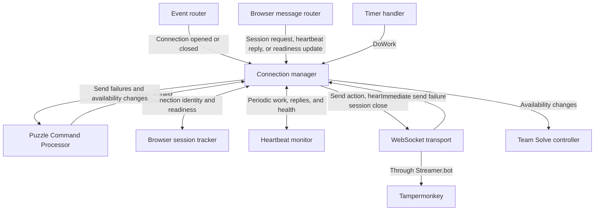
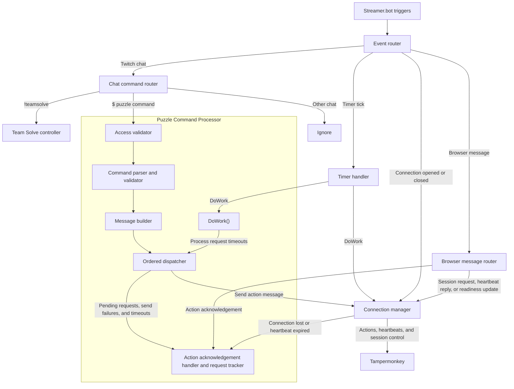
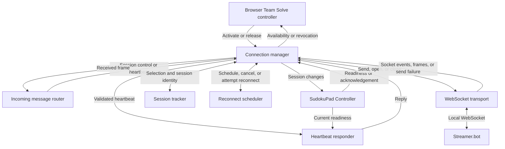
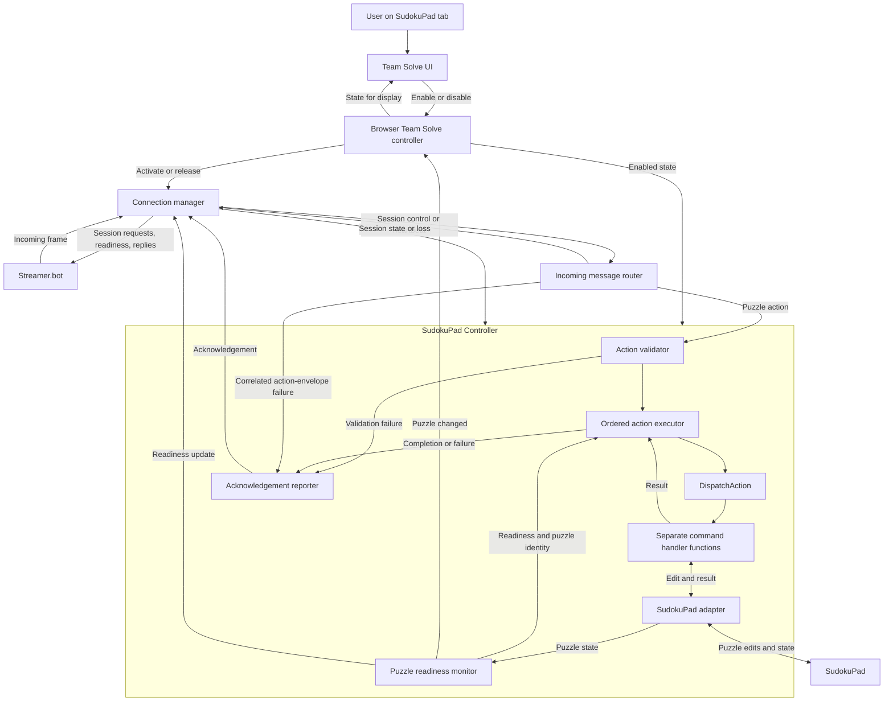

# Team Solve component design

First draft. These are logical components; each does not necessarily need its own file or Streamer.bot action. Streamer.bot owns chat input and contribution policy. Tampermonkey owns execution against the current SudokuPad puzzle. They communicate over a local WebSocket using structured action messages and correlated acknowledgements, defined in the [puzzle command protocol](puzzle-command-protocol.md).

Team Solve has two independent enable switches. A streamer or moderator enables contributions through the Twitch `!teamsolve` command interface, and the user enables Team Solve for the current puzzle through the SudokuPad tab UI. Commands run only when both sides are enabled, that tab has the accepted browser session, and its puzzle is ready. Changing either switch does not change the other switch or the saved chat access settings. The Streamer.bot switch persists across sessions; the browser switch belongs to the current puzzle instance and starts disabled on every puzzle load or reload.

## Streamer.bot

Routing has two levels. Streamer.bot triggers feed a top-level **event router**, which selects handlers by event type. Twitch chat and browser messages then pass through their own subrouters to select a handler by command or message type. Each timer tick goes to a timer handler, which calls `DoWork()` on the Puzzle Command Processor and the connection manager. Connection-opened/closed events go directly to the connection manager. These routers can be methods within the same C# script; they choose destinations while the receiving components own behavior and state.

| Component | Responsibility and relationships |
| --- | --- |
| Event router | Receives Twitch chat, timer ticks, connection-opened/closed events, and incoming browser messages from Streamer.bot triggers. Routes chat to the chat command router, browser messages to the browser message router, and connection events to the connection manager. Routes timer ticks to the timer handler. Preserves event context for the receiving component. |
| Timer handler | Receives timer ticks from the event router and calls `DoWork()` on the Puzzle Command Processor and the connection manager. Coordinates periodic work; each component owns its maintenance logic. |
| Chat command router | Separates puzzle commands, `!teamsolve` control commands, and unrelated chat. Routes puzzle commands to the Puzzle Command Processor and control commands to the Team Solve controller. Ignores unrelated chat and preserves command text, sender context, and puzzle-command arrival order. |
| Browser message router | Decodes and validates incoming message envelopes, then routes session activation/resume/release requests, heartbeat replies, and readiness updates to the connection manager and action acknowledgements to the Puzzle Command Processor. Preserves connection context and request IDs. Rejects malformed or unsupported messages and reports them to diagnostics. |
| Team Solve controller | Handles control commands and checks that the sender is the streamer or a moderator. Owns enabled state, the selected access option, and the saved user list. Combines those settings with browser readiness to determine whether contributions are active, off, or waiting. Sends state changes and status replies to chat feedback. |
| Settings store | Saves and restores the controller's enabled state and access settings across sessions. Keeps persistent preferences separate from temporary connection and request state. |
| Puzzle Command Processor | Owns the puzzle-command lifecycle: access validation, command parsing and validation, message building, ordered dispatch, and action acknowledgement handling. Receives commands from the chat command router, acknowledgements from the browser message router, and `DoWork()` calls from the timer handler. Its `DoWork()` delegates request timeout processing to the ordered dispatcher. Uses controller policy and connection readiness, sends messages through the connection manager, and supplies outcomes to chat feedback and diagnostics. |
| Connection manager | Coordinates the WebSocket transport, browser session tracker, and heartbeat monitor. Receives connection events from the event router, session activation/resume/release requests, heartbeat replies, and readiness updates from the browser message router, send requests from the Puzzle Command Processor, and `DoWork()` calls from the timer handler. Exposes browser availability and notifies the controller and processor when it changes. |
| Chat feedback | Turns control results, state changes, permission failures, and syntax errors into public Twitch replies. Receives outcomes from the controller and Puzzle Command Processor. Successful puzzle actions use the visible puzzle change as feedback. |
| Diagnostic logger | Collects events from the other components into a persistent per-stream log. Correlates input, validation, sending, and browser outcomes by request ID, retaining sender context where applicable. |

The **Puzzle Command Processor** contains these responsibilities:

| Internal component | Responsibility and relationships |
| --- | --- |
| Access validator | Checks sender permissions, Team Solve state, and browser readiness using controller policy and Twitch user information. Passes permitted commands to the parser and sends rejection reasons to feedback and diagnostics. |
| Command parser and validator | Checks syntax and values against the [chat command language](../docs/twitch-command-language.md). Produces a normalized action with explicit targets and operations for the message builder. Leaves puzzle-dependent checks to Tampermonkey and sends syntax errors to chat feedback. |
| Message builder | Wraps the normalized action in the shared message format with a protocol version and request ID. Supplies the serialized message to the dispatcher while retaining Twitch sender context locally for feedback and diagnostics. |
| Ordered dispatcher | Registers pending requests with the acknowledgement handler and sends messages through the connection manager in command order. When invoked by the processor's `DoWork()`, checks pending request deadlines through the request tracker and reports expired requests to the acknowledgement handler for completion as timeouts. Also reports send failures to the acknowledgement handler. Does not retain disconnected commands for later delivery or automatically retry uncertain actions. |
| Action acknowledgement handler and request tracker | Matches browser acknowledgements to pending requests and their originating commands. Completes requests on acknowledgement, send failure, timeout, or connection loss, and records outcomes through diagnostics. Handles duplicate or unmatched acknowledgements without completing a request twice. |

The **connection manager** contains these responsibilities:

| Internal component | Responsibility and relationships |
| --- | --- |
| WebSocket transport | Sends messages to the intended browser through Streamer.bot's WebSocket integration and reports immediate send failures to the connection manager. Streamer.bot owns the underlying sockets and emits connection and message events through the configured triggers. A successful send does not establish that a puzzle action was executed. |
| Browser session tracker | Owns the single active browser session, its connection identity, selected puzzle, and reported readiness. A socket opening does not activate a session. Accepts explicit activation requests through the manager, revokes the previous session on replacement, and requires fresh readiness information before contributions resume. Associates updates with the current session so stale replies cannot restore readiness after reconnection. Supplies session state to the manager for availability checks and message targeting. |
| Heartbeat monitor | Tracks heartbeat IDs, outstanding requests, reply deadlines, and when the next heartbeat is due. During the manager's `DoWork()`, checks for expiry and requests heartbeat sends through the manager and transport. Matches replies to the current session and heartbeat request, then reports health and returned readiness to the manager. |

The manager combines connection state, heartbeat health, and puzzle readiness into browser availability. Before sending a puzzle message, it checks that the intended session is still available. It returns immediate send failures to the Puzzle Command Processor, which retains ownership of action acknowledgements and request timeouts. Incoming message decoding remains with the browser message router.

Only one browser session may be active for Team Solve. Enabling Team Solve in the tab UI initiates an explicit activation request for the current puzzle; connection or readiness events alone cannot claim the active session. Selecting a tab is separate from the controller's saved Team Solve enabled state and does not change chat access settings. The browser may be accepted and remain connected while Streamer.bot's switch is off, but Streamer.bot dispatches no puzzle commands until its switch is also on. Disabling the browser releases its session and makes it unavailable without changing Streamer.bot's saved enabled state.

The session tracker accepts a release only for the current selection and clears its ownership and resume eligibility. The manager notifies the controller and processor of lost availability and closes pending requests without retrying. A stale release must not revoke a newer selection. A plain connection loss can preserve selection eligibility for transient reconnection; explicit release ends it.

The manager serializes activation requests. When accepting a new selection, it first revokes the old session and pauses dispatch, closes its pending requests through the processor without replaying them, and sends the old browser a session-close message through the transport before closing that connection. It then accepts the new session and waits for its readiness. Revocation takes effect locally even if the old browser cannot receive the close; old messages and automatic resume attempts cannot reclaim ownership. On receiving the close, the old tab disables its browser switch, discards queued actions, and requires another explicit user activation. An action already executed before replacement cannot be undone by closing the session.

Connection loss or heartbeat expiry makes the browser unavailable: the manager notifies the Team Solve controller to pause contributions and the Puzzle Command Processor to close pending requests without retrying them. A readiness update can also pause contributions while the socket remains connected. Tampermonkey may reconnect automatically for the same explicitly selected puzzle after a transient disconnect. The session tracker accepts a resume only for the still-current selection, assigns a fresh connection session identity, and requires fresh readiness. A resume cannot replace another selected tab; a rejected resume requires a new explicit user activation. The controller resumes contributions only when the browser is available and Team Solve is still enabled. The processor associates pending actions with their session so old acknowledgements cannot complete new requests.

The connection manager's internal relationships are:

The routing layers and the processor's internal relationships are:

Browser replies return through Streamer.bot's message-received trigger and the two routing levels. A repeating Streamer.bot timer supplies ticks independently of chat activity. The event router forwards each tick to the timer handler, which calls `DoWork()` on both components even when no commands or browser replies arrive. The Puzzle Command Processor delegates timeout processing to its ordered dispatcher, while the connection manager maintains heartbeats. Each `DoWork()` performs currently due work and returns without waiting for browser responses. The acknowledgement handler completes each request at most once, including when a reply arrives after a timeout. The connection manager tracks heartbeat responses and puzzle readiness; the controller combines browser availability with saved enabled state to determine whether contributions are active, off, or waiting.

The controller reads and writes the settings store, supplies policy to the processor's access validator, and receives readiness changes from the connection manager. The controller checks control-command permissions without requiring contributions to be enabled or the browser to be ready. Feedback and logging support these paths.

## Tampermonkey

The userscript separates tab enablement, connection lifecycle, and puzzle execution. The UI sends enable/disable intentions to the browser Team Solve controller. The connection manager passes received frames to the incoming message router, which routes connection messages back to the manager and puzzle actions to the SudokuPad Controller. Browser callbacks supply socket, timer, and page lifecycle events independently of incoming actions; the action queue never delays session-close or heartbeat handling.

| Component | Responsibility and relationships |
| --- | --- |
| Team Solve UI | Provides an enable/disable control for the current SudokuPad puzzle. Sends user intentions to the browser Team Solve controller and displays its enabled state together with connection and puzzle readiness status. Explains when another tab has replaced this one or a puzzle change requires enablement again. |
| Browser Team Solve controller | Owns the tab's enabled state, scoped to its current puzzle instance. On enable, asks the connection manager to activate that puzzle. On disable, immediately prevents further execution and asks the manager to release and disconnect the session. Clears enabled state on replacement, rejected activation/resume, or puzzle load/reload, and supplies state to the UI and SudokuPad Controller. Does not change Streamer.bot's switch or access policy. |
| Connection manager | Coordinates WebSocket transport, session tracking, reconnection, and heartbeat responses. Receives activation/release intentions from the browser Team Solve controller, connection messages from the router, and readiness and acknowledgement sends from the SudokuPad Controller. Notifies both controllers when session availability changes. |
| Incoming message router | Decodes the shared envelope and checks message type, protocol version, and correlation fields. Routes validated session-control and heartbeat messages to the connection manager and puzzle-action envelopes to the SudokuPad Controller. Preserves the originating connection and request identifiers. Sends correlated action-envelope failures to the acknowledgement reporter and uncorrelatable or non-action failures to diagnostics. |
| SudokuPad Controller | Owns action validation, ordered execution, puzzle readiness, and acknowledgement production. Receives actions from the router, enabled state from the browser Team Solve controller, and session state from the connection manager. Coordinates the adapter and readiness monitor, and invalidates queued work when its enabled state, session, or puzzle is no longer valid. |
| Diagnostic logger | Records connection transitions, validation failures, execution outcomes, and failed acknowledgement sends, using request, session, and puzzle identifiers where available. Keeps browser-side evidence when Streamer.bot cannot receive a reply. Avoids credentials and secrets; log storage and retention remain implementation decisions. |

The **connection manager** contains these responsibilities:

| Internal component | Responsibility and relationships |
| --- | --- |
| WebSocket transport | Opens the local WebSocket only for an explicit enable request or an eligible reconnect attempt. Reports open, close, error, and received-frame events to the manager. Sends messages on the intended connection and reports immediate send failures. Does not retain puzzle actions or acknowledgements for a future connection. |
| Session tracker | Tracks the selected puzzle, activation/resume attempt, accepted session identity, and whether the selection may resume. Supplies current session context to the manager and SudokuPad Controller. A socket opening is not session acceptance. Invalidates old connection identities so delayed callbacks and messages cannot restore a revoked session. |
| Reconnect scheduler | Schedules connection attempts with bounded backoff while the tab remains enabled for the same eligible puzzle selection. Distinguishes retrying an initial activation attempt from resuming an accepted selection. Cancels scheduled attempts on disable, replacement, rejected activation/resume, or puzzle change. A reconnect callback rechecks eligibility before opening a socket. |
| Heartbeat responder | Receives validated heartbeat requests through the manager and answers with the original heartbeat ID and current readiness from the SudokuPad Controller. Uses only the current accepted session. Streamer.bot initiates heartbeats and owns heartbeat deadlines; the responder does not wait for the action queue. |

On socket open, the manager requests activation or resume as appropriate and waits for acceptance before admitting puzzle actions. Resume is limited to the still-current selection and receives a fresh connection session identity and fresh readiness reporting. A rejected resume clears browser enablement and requires a new explicit enable action; it must not silently become a fresh activation request that takes over another tab. Selection recovery after a Streamer.bot restart must follow this same rule; how resume eligibility survives a restart remains an open connection-protocol decision.

An explicit activation rejection also disables the browser switch and reports the reason to the UI. A transient transport failure before an activation response instead permits an eligible retry; reconciling attempts whose acceptance response was lost remains part of the connection-protocol design.

On transient connection loss, the manager invalidates the connection session, notifies the SudokuPad Controller to discard queued actions, and schedules an eligible reconnect. The browser switch remains enabled. On an explicit disable or a puzzle change, local execution eligibility is revoked immediately, queued actions are discarded, reconnect attempts are cancelled, and the manager releases the session and closes the socket. Local shutdown does not wait for a successful release notification. Streamer.bot treats session release or connection closure as loss of availability and completes pending requests without replaying them.

On a session-close message caused by replacement, the manager invalidates the session, tells the browser Team Solve controller to disable the tab with a replacement explanation, discards queued work through the SudokuPad Controller, and closes its socket. If that message cannot reach the old tab, Streamer.bot still revokes it locally and rejects its later resume attempts. Stale messages cannot grant execution eligibility.

The connection manager's internal relationships are:

The **SudokuPad Controller** contains these responsibilities:

| Internal component | Responsibility and relationships |
| --- | --- |
| Action validator | Checks the complete structured action against the protocol: kind/operation combination, target shape, required fields, field types, and ranges. Checks browser enablement and session/puzzle identity on receipt, then produces a normalized internal action with its original correlation and connection context. Sends failures to the acknowledgement reporter. Twitch syntax and sender permissions remain in Streamer.bot. |
| Ordered action executor | Owns a single FIFO action queue and runs one action at a time. Rechecks enablement, accepted session, puzzle identity, and readiness immediately before execution. Uses a shared dispatch function to select a separate handler for each action kind. Collects handler results or exceptions and completes each request through the acknowledgement reporter. Discards invalidated queued work and never carries it into another session or puzzle. |
| Puzzle readiness monitor | Uses the adapter to observe page state and integration availability. Owns a fresh `puzzleId` for each puzzle load or reload, including the same puzzle loaded again. Supplies current readiness and puzzle identity to the executor, connection manager, and UI through their controllers. A new puzzle instance immediately invalidates previous work and tells the browser Team Solve controller to clear enablement. |
| SudokuPad adapter | Owns all SudokuPad-specific inspection and mutation. Command handlers call its explicit edit operations; the readiness monitor calls its inspection hooks. Checks puzzle-dependent constraints such as playable cells and givens, preserves SudokuPad state and rendering, and reports results including valid actions that have no effect. Does not manage WebSocket messages, the action queue, or chat policy. |
| Acknowledgement reporter | Receives correlated validation failures and execution outcomes. Builds at most one terminal acknowledgement per request, preserving the original `requestId`, `sessionId`, and `puzzleId`. Sends it through the connection manager on its originating connection when possible, and records the result or delivery failure in diagnostics. Does not resend old results on a new session. |

The ordered executor has an explicit `DispatchAction` function and a separate function for each distinct command type. Dispatch is based on `action.kind`; operations within that kind belong to its handler:

| Action kind | Handler function | Supported operations |
| --- | --- | --- |
| `value` | `HandleValue` | `set`, `clear` |
| `cornerMarks` | `HandleCornerMarks` | `add`, `remove`, `clear` |
| `centerMarks` | `HandleCenterMarks` | `add`, `remove`, `clear` |
| `color` | `HandleColor` | `add`, `remove`, `clear` |
| `x` | `HandleX` | `add`, `remove` |
| `o` | `HandleO` | `add`, `remove` |
| `line` | `HandleLine` | `add`, `remove` |

Each handler receives the validated action and execution context for the intended session and puzzle, invokes the relevant adapter operation, and returns the same result shape: `understood`, or `failed` with a stable reason and optional diagnostic description. Handlers neither manage the queue nor send acknowledgements. Shared ordering, execution guards, exception handling, and completion logic surround dispatch so every handler follows the same lifecycle. Unknown kinds and unsupported operations fail validation without invoking an adapter operation.

To add a command type, extend the shared protocol and action validation rules, register a new handler in dispatch, and add adapter support. The queue, connection manager, and acknowledgement path remain unchanged. Separate handler functions are required even when some handlers share low-level adapter helpers.

The routing layers and the controller's internal relationships are:

For a normal action, the router validates the envelope, the action validator checks the complete action and its intended context, and the executor queues it in received order. When it reaches the front, the executor rechecks eligibility and calls `DispatchAction`, which selects exactly one handler. The handler uses the adapter and returns a result; the executor passes that result to the reporter before advancing to the next action. Completion does not require waiting for Streamer.bot to acknowledge the reply.

Validation completes before any part of an action changes the puzzle. A structurally valid action that cannot affect the board, such as editing a given or targeting a positive coordinate outside the playable grid, returns `understood` without a visible change. A puzzle mismatch returns `failed` with `puzzleChanged`, and unavailable integration returns `failed` with `puzzleNotReady`. Other stable failure codes remain to be named in the protocol. Malformed input without the required correlation identifiers is rejected and logged without inventing identifiers.

Connection or puzzle invalidation discards queued actions and prevents further edits from starting. An action already applied cannot be undone by disabling or replacing the session, and a lost reply leaves Streamer.bot uncertain whether that edit occurred. Neither side automatically retries. If an adapter operation yields asynchronously, it must recheck the original execution context before any later mutation; the next queued action cannot begin while the preceding operation may still mutate the puzzle. Streamer.bot's acknowledgement timeout alone does not cancel a running browser operation. Browser execution deadlines and cancellation support remain integration decisions.

The UI presents browser enablement separately from connection/readiness status:

| Event or condition | Browser state and behavior |
| --- | --- |
| Initial page load or puzzle reload | Disabled; inspect the puzzle but do not connect automatically. |
| User enables the current puzzle | Enabled and connecting; request explicit activation, then wait for acceptance and readiness. |
| Session accepted and puzzle ready | Enabled and ready to receive commands. This does not imply Streamer.bot's separate switch is on. |
| Same puzzle temporarily not ready | Remain enabled; report not ready and prevent execution until readiness returns. |
| Transient connection loss | Remain enabled and show reconnecting; discard queued actions and attempt only eligible activation/resume. |
| User disables this tab | Disabled; revoke execution eligibility, discard queued actions, release the session, cancel reconnects, and disconnect. |
| Another tab replaces this tab, or activation/resume is rejected | Disabled with an explanation; require a new explicit enable action. |
| Puzzle instance changes | Disabled; invalidate the old puzzle's work and require enablement for the new instance. |
| Streamer.bot contributions are turned off through Twitch | The browser switch remains unchanged and its accepted connection may remain open; Streamer.bot stops dispatching new commands. |

The browser UI must not infer the Streamer.bot switch from an open socket or the absence of actions. A browser display of chat contribution state would require an explicit state message, whose format is not yet defined. The shared action contract remains independent of Twitch permissions and SudokuPad implementation details; the [userscript guide](../docs/tampermonkey-userscript.md) records integration constraints and remaining implementation decisions.
